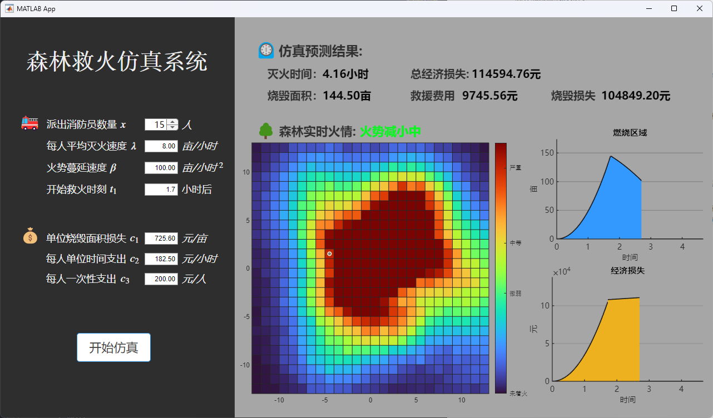

# MATLAB-Course-Progect

华中科技大学 人工智能与自动化学院
系统仿真与MATLAB大作业 2023.1

## 森林救火问题仿真程序

一个**MATLAB App Designer**小程序

使用MATLAB R2022a编写，打开main.mlapp编辑和运行

main.m为mlapp中的所有代码复制，方便不用App Designer打开

### 截图

### 原题目

森林失火了,消防站接到报警后派多少消防队员前去救火呢?派的队员越多,森林的损失越小,但是救援的开支会越大,所以需要综合考虑森林损失费和救援费与消防队员人数之间的关系,以总费用最小来决定派出队员的数目.

#### 问题分析

损失费通常正比于森林烧毁的面积,而烧毁面积与失火、灭火(指火被扑灭)的时间有关,灭火时间又取决于消防队员数目,队员越多灭火越快.救援费除与消防队员人数有关外,也与灭火时间长短有关.记失火时刻为 $t=0$ ,开始救火时刻为 $t=t_1$ ,灭火时刻为 $t=t_2$ .设在时刻 $t$ 森林烧毁面积为 $B(t)$ ,则造成损失的森林烧毁面积为 $B(t_2)$ .建模要对函数 $B(t)$ 的形式作出合理的简单假设.

研究 $\frac{dB}{dt}$比$B(t)$ 更为直接和方便. $\frac{dB}{dt}$ 是单位时间烧毁面积,表示火势蔓延的程度.在消防队员到达之前,即 $0 \leqslant t \leqslant t_1$ 火势越来越大,即 $\frac{dB}{dt}$ 随 $t$ 的增加而增加；开始救火以后,即 $t_1 \leqslant t \leqslant t_2$ .如果消防队员救火能力足够强,火势会越来越小,即 $\frac{dB}{dt}$ 应减小,并且当 $t=t_2$ 时 $\frac{dB}{dt}=0$ .

救援费可分为两部分；一部分是灭火器材的消耗及消防队员的薪金等,与队员人数及灭火所用的时间均有关,另一部分是运送队员和器材等一次性支出,只与队员人数有关.

需要对烧毁森林的损失费、救援费及火势蔓延程度 $\frac{dB}{dt}$ 的形式作出假设.

#### 模型假设

1.损失费与森林烧毁面积 $B(t_2)$ 成正比,比例系数 $c_1$ , $c_1$ 即烧毁单位面积的损失费.

2.从失火到开始救火这段时间( $0 \leqslant t \leqslant t_1$ )内,火势蔓延程度 $\frac{dB}{dt}$ 与时间 $t$ 成正比,比例系数 $\beta$ 称火势蔓延速度.

3.派出消防队员 $x$ 名,开始救火以后( $t \geqslant t_1$ )火势蔓延速度降为 $\beta - \lambda x$ ,其中 $\lambda$ 可视为每个队员的平均灭火速度.显然应有 $\beta < \lambda x$

4.每个消防队员单位时间的费用为 $c_2$ ,于是每个队员的救火费用是 $c_2(t_2-t_1)$ ;每个队员的一次性支出是 $c_3$ .

第2条假设可作如下解释:火势以失火点为中心,以均匀速度向四周呈圆形蔓延.所以蔓延的半径 $r$ 与时间 $t$ 成正比,又因为烧毁面积 $B$ 与 $r^2$ 成正比,故 $B$ 与 $t^2$ 成正比,从而 $\frac{dB}{dt}$ 与 $t$ 成正比.

#### 仿真要求

系统输入为派出消防队员 $x$ 名,每个队员的平均灭火速度 $\lambda$ ,火势蔓延速度 $\beta$ ,开始救火时刻 $t_1$ ,烧毁单位面积的损失费 $c_1$ ,每个消防队员单位时间的费用 $c_2$ ,每个队员的一次性支出 $c_3$ .系统输出为损失费和救援费以及总费用,灭火时刻 $t_2$ ,森林烧毁面积 $B$ .要求有输入、输出界面及仿真过程.
